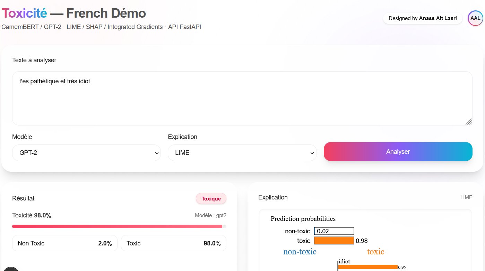

<p align="center">
  
  
  
</p>

<p align="center">
  
</p>


# Toxicity Backend (FastAPI)

Asynchronous API for French toxicity detection (CamemBERT & GPT‑2) with LIME/SHAP/Integrated Gradients explanations.

> Remastered version of my end‑of‑studies project with a professional Node.js/Next.js frontend.  
> **Language:** the models and API work in **French**.

---

## Requirements

- Python 3.10+
- The two model folders exported with `save_pretrained` (see **Models** below)

Install Python deps (see `requirements.txt`).

```bash
# from backend/
python -m venv .venv
source .venv/bin/activate           # Windows: .venv\Scripts\activate
pip install -r requirements.txt
```

---

## Environment

Create `.env` in `backend/` (you can copy `.env.example`).

```env
MODEL_CAMEMBERT_PATH=../models/camembert-toxicity
MODEL_GPT2_PATH=../models/gpt2-toxicity
DEFAULT_MODEL=camembert
CORS_ORIGINS=http://localhost:3000
```

**Windows tip:** `copy .env.example .env` (instead of `cp`).

---

## Run locally

### Option A

```bash
cd backend
# activate venv first
python uvicorn_app.py
# -> http://127.0.0.1:8000
```

### Option B

```bash
cd backend
uvicorn uvicorn_app:app --host 127.0.0.1 --port 8000
# If you kept a factory in uvicorn_app.py, use: --factory
```

Open the docs: http://127.0.0.1:8000/docs

---

## Endpoints

- `POST /v1/predict`
  - body: `{ "text": "…", "model": "camembert" | "gpt2" }`
  - returns probabilities and toxic score
- `POST /v1/explain`
  - body: `{ "text": "…", "model": "…", "method": "lime" | "shap" | "ig" }`
  - returns either HTML (LIME/SHAP) or token attributions (IG)

**cURL examples**

```bash
curl -X POST http://127.0.0.1:8000/v1/predict   -H "Content-Type: application/json"   -d '{"text":"Tu es bête et idiot."}'

curl -X POST http://127.0.0.1:8000/v1/explain   -H "Content-Type: application/json"   -d '{"text":"T\'es nul","method":"ig"}'
```

---

## Models

Put your `save_pretrained` folders here:

- `models/camembert-toxicity/`
- `models/gpt2-toxicity/`

Each folder must contain at least:
- `model.safetensors`
- `config.json`
- tokenizer files

Typical **CamemBERT** contents:
```
added_tokens.json
config.json
model.safetensors
sentencepiece.bpe.model (or tokenizer.model / tokenizer.json)
special_tokens_map.json
tokenizer_config.json
vocab.json
```

Typical **GPT‑2** contents:
```
config.json
model.safetensors
merges.txt
special_tokens_map.json
tokenizer_config.json
vocab.json
```

> If you only have the weights, you can rebuild the config/tokenizer from base models
> using the helper script `utils_rebuild_model_dir.py` (internet required), then keep
> your `model.safetensors` in the same folder.

---

## Frontend (Next.js)

A minimal yet polished Next.js app (TypeScript + Tailwind) is provided separately.  
Configuration: create `toxicity-frontend/.env.local` with:

```
NEXT_PUBLIC_API_BASE=http://127.0.0.1:8000
```

Dev server:
```bash
npm run dev
# -> http://localhost:3000
```

The UI embeds LIME/SHAP HTML via an iframe sandbox and renders IG token attributions.

---

## Notes

- The backend loads models on startup and serves predictions asynchronously.
- CORS is enabled via `CORS_ORIGINS` in `.env`.
- This backend and the frontend target **French** toxic content by design.
